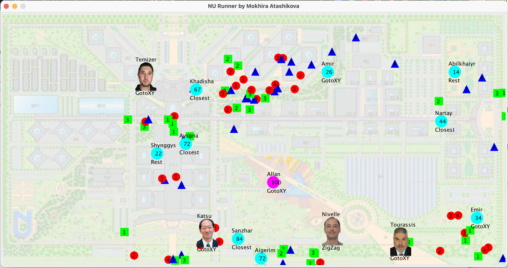
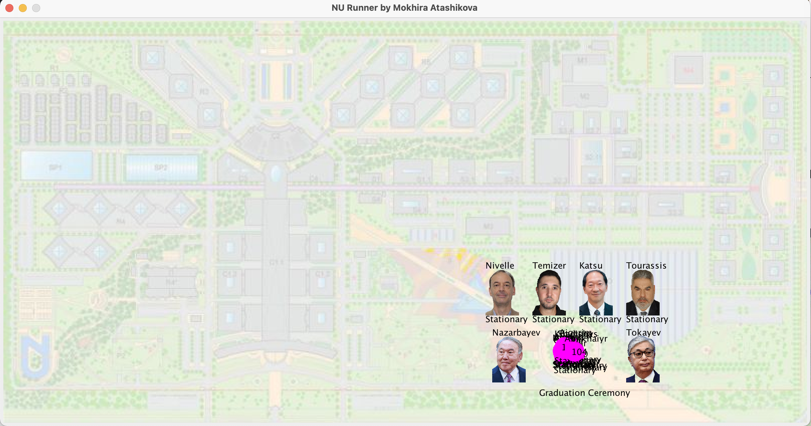

# Animation of students graduation

This project builds an animation about university students collecting grades (up to 100) to finish the school, and having a graduation ceremony in the end. 

OOP design principles are used when bulding the animation. 
Design is extended by software design patterns as State and Abstract Factory. 

The following is a detailed UML class describing important aspects of the implementation. 

The screenshot below shows students collecting grades to graduate. 
* Students are represented by blue circles with their names on top and motion states on the bottom
* Green, blue and red shapes represent assignments with weights written on them
* Professors are represented with their corresponding pictures, names and motion states

The next screenshot shows the graduation ceremony at the end of the animation.

