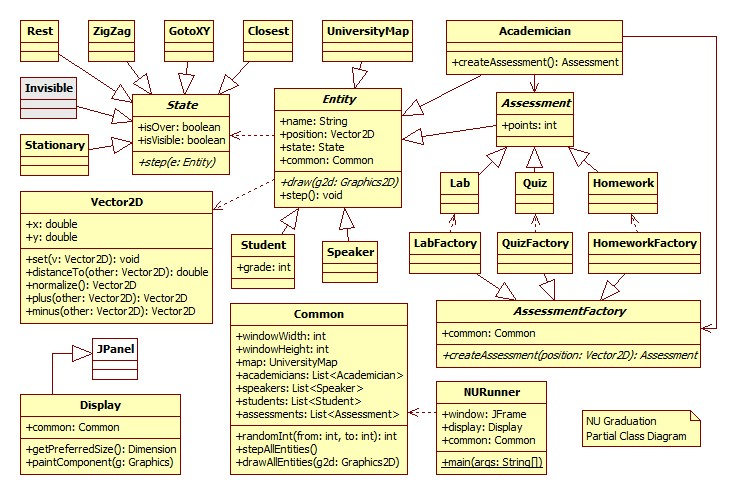

# Animation of students graduation

This project builds an animation about university students collecting grades (up to 100) to finish the school, and having a graduation ceremony in the end. 

OOP design principles are used when bulding the animation. 
Design is extended by software design patterns as State and Abstract Factory. 

The following is a detailed UML class describing important aspects of the implementation. 

